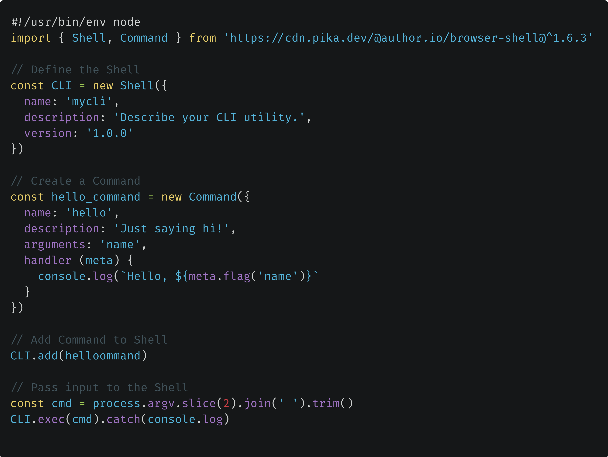

# CLI First Strategy

This repo houses materials and examples from my OpenJS World 2020 talk, **The Benefits of a "CLI First" Strategy** on June 24th, 2020 (12:10-12:40 CDT).

The audio cut in/out during the live stream of this. The original HD version can be found on [https://youtu.be/4J2AHecINM0](https://youtu.be/4J2AHecINM0).

This strategy is one I've been iterating on for quite awhile now, with pretty big plans for making the process better. If you are interested in updates, seeing future videos, and/or the evolution of this strategy, follow this repo and follow me on Twitter ([@goldglovecb](https://twitter.com/goldglovecb)) where I'll make announcements.

The [Powerpoint Presentation](./presentation.pptx) is available in this repo. See the examples directory for code snippets. The examples may require some adjustments to work, since I did not have time to test them after completing each phase of the presentation.

The tools used in the making of this were:

1. The [author/shell](https://github.com/author/shell) framework for creating CLI tools. 
      
1. The [Chrome Devtools CLI Extension](https://chrome.google.com/webstore/detail/cli/okpglddgmnblhbdpdcmodmacgcibgfkf)
    
1. The [@butlerlogic/common-api](https://github.com/butlerlogic/common-api) library. High level overview available in [this Quora article](https://www.quora.com/q/knwgdmodjdvomgbj/Introducing-Common-API-for-Node-js)
    
1. [Fenix Web Server 3.0.0](https://preview.fenixwebserver.com), a desktop web server for serving the frontend.
    

I use Fenix to host static content and the common-api lib to rapidly prototype API's. These two tools make it easy to experiment with CLI's within a pseudo "full stack" system.

---

These are the efforts/ventures that keep me working on this stuff:

<table cellpadding="10" cellspacing="0" border="0">
  <tr>
    <td></td>
    <td></td>
  </tr>
</table>
